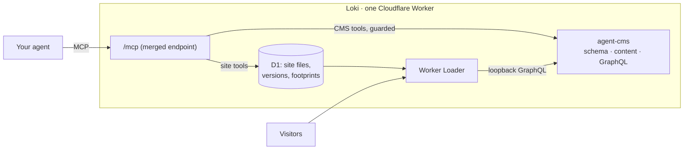

<picture>
  <source media="(prefers-color-scheme: dark)" srcset="assets/logo-dark.svg">
  
</picture>

**Loki lets an AI agent run an entire website at runtime — content schema, content, code, routes, and design — through a single MCP endpoint.** No repo to clone, no build pipeline, no deploy step. The agent writes TSX, previews it at a real URL, and publishes by repointing a version. Rollback is instant. A failed publish never touches the live site.

Loki is a single Cloudflare Worker built on [agent-cms](https://github.com/jokull/agent-cms) (agent-first headless CMS: D1, GraphQL, MCP) and [Dynamic Workers](https://developers.cloudflare.com/workers/runtime-apis/bindings/worker-loader/) (the Worker Loader API, open beta). Site code lives in the database, compiles at write time, and executes in sandboxed V8 isolates loaded on demand.

## Why

Agents are already good at building websites. What slows them down is the ceremony around the code: branches, pull requests, CI, deploys — a loop designed for humans coordinating with humans. agent-cms moved *schema and content* into the runtime loop; Loki moves the rest of the site there too. "Deploy" collapses into a database write, and the whole edit → preview → publish cycle happens inside one conversation.

The safety you lose by skipping CI is re-created where an agent can actually use it:

- **Publish-time validation** — every GraphQL query in the site is validated against the live schema; a smoke render runs in a throwaway sandbox. Errors come back precise (`routes/index.tsx#gql0: Cannot query field "subtitle" on type "BlogPostRecord". Did you mean "title"?`) and the live site stays untouched.
- **Immutable versions** — publishing snapshots the compiled site; `rollback_site` repoints a pointer.
- **A migration guard** — Loki records which schema fields each published version queries (its *footprint*). Destructive schema operations that would break the live site are rejected with an error that teaches the expand → backfill → publish → contract order.

## Architecture



- **Merged MCP endpoint.** Loki exposes one `/mcp`: its own site tools plus every agent-cms tool, proxied in-process. Destructive schema calls pass through the migration guard first.
- **Site ring.** Source files (TSX/TS/CSS) are stored in D1 and transpiled on write (sucrase). Publishing snapshots a compiled module map into a version row.
- **Serving.** Public traffic loads the published version into a V8 isolate via `LOADER.get("site:v<N>")` — milliseconds on cold start, cached while warm. The isolate gets exactly two capabilities: a loopback GraphQL binding into the CMS and nothing else (`globalOutbound: null`).
- **Preview.** `preview_site` mints a 30-minute token; the draft tree serves at the real domain behind an HttpOnly cookie, with draft content included in queries.

## The authoring model

The agent writes Preact routes with file-based routing:

```tsx
// routes/posts/[slug].tsx
import { gql, query, renderStructuredText } from "loki/runtime";

const POST = gql`
  query Post($slug: String!) {
    blogPost(filter: { slug: { eq: $slug } }) {
      title
      body { value }
    }
  }
`;

export async function loader({ env, params }) {
  const data = await query(env, POST, { slug: params.slug });
  return { post: data.blogPost };
}

export const head = (props) => ({ title: props.post?.title ?? "Post" });

export default function Post({ post }) {
  return (
    <article>
      <h1>{post.title}</h1>
      {renderStructuredText(post.body?.value)}
    </article>
  );
}
```

`routes/index.tsx` → `/`, `routes/posts/[slug].tsx` → `/posts/:slug`, `styles.css` → linked stylesheet. A `main.ts` default-exporting a fetch handler is the escape hatch from file routing. The full guide lives in the `site_help` tool — the endpoint documents itself.

## Tools

On top of the full agent-cms toolset (models, fields, records, publishing, assets, search), Loki adds:

| Tool | What it does |
| --- | --- |
| `site_write` / `site_read` / `site_list` / `site_delete` | Edit the draft tree; writes transpile immediately and reject on error |
| `site_asset_import` / `site_asset_write` | Add design images and one-off files (favicon, OG image, hero, downloads) by URL or bytes; returns the exact URL to paste |
| `site_diff` | Draft vs. published: added / changed / removed, code and assets |
| `graphql_query` | Explore the content API (introspection included) before writing route queries |
| `preview_site` | Token URL serving the draft at the real domain |
| `publish_site` | Validate queries → extract footprint → smoke render → snapshot → go live |
| `site_versions` / `rollback_site` | List immutable versions; repoint the live pointer |
| `site_help` | The authoring guide, served by the endpoint itself |

Beyond static pages, routes can export typed **`serverFn`** server functions (validated, sandboxed, callable from loaders and from islands over RPC), write to allowlisted content models (`env.RECORDS`), and push to WebSocket channels (`env.REALTIME`) — and any component can become a hydrated **Preact island** for client-side interactivity, served with no bundler via native ES modules and import maps. A live realtime guestbook, per-post reactions, forms, and design assets all run this way today.

**npm dependencies, no install or build step.** An agent can `import` a workerd-compatible ESM package and Loki resolves it via esm.sh at write time — snapshotted self-contained, content-addressed, version-pinned into the published version — with no `npm install`, no `node_modules`, and no bundler config. `site_write` reports exactly what was pinned (`resolvedDeps` with a `loadable` compatibility flag). Server-only dependencies never reach the browser.

**A feature database via Drizzle.** For custom features that need their own relational state, agents query a dedicated D1 with Drizzle (`drizzle-orm/sqlite-proxy` + a `featuresDriver(env)` helper). Raw database access never enters the sandbox — it's mediated by an RPC entrypoint, because the platform *enforces* it: raw bindings can't cross the Worker Loader boundary, only capability stubs can. A live newsletter signup runs on this today. Feature-table schema is managed out-of-band (your own drizzle-kit/atlas), so Loki provides query access, not migrations.

## Quickstart

You need a Cloudflare account on Workers Paid (for Worker Loader, open beta), `pnpm`, and `wrangler` logged in.

```sh
git clone https://github.com/jokull/loki && cd loki
pnpm install && pnpm vendor

wrangler d1 create loki-cms        # put the new database_id in wrangler.jsonc
wrangler d1 migrations apply loki-cms --remote
wrangler secret put WRITE_KEY      # any long random string
wrangler deploy
```

Connect your agent (Claude Code shown; any MCP client works):

```sh
claude mcp add loki https://loki.<your-subdomain>.workers.dev/mcp \
  --transport http --header "Authorization: Bearer <WRITE_KEY>"
```

Then ask for a website:

> Read site_help. Create a blog with a few posts about anything, design it nicely, preview it, and publish.

In the first end-to-end test, an agent given nothing but the endpoint URL and the key did exactly that — schema, content, routes, stylesheet, dark mode — and shipped it, self-correcting from the validation errors along the way.

## The migration guard

The part CI can't do for you. Each published version stores the set of GraphQL types and fields it queries. When the agent later tries `delete_field` on something the live site depends on:

```
Blocked by Loki migration guard: The published site (version v5) still queries
field "slug" (GraphQL BlogPostRecord.slug) on model "blog_post".
Follow the expand -> contract migration order:
  1. EXPAND: add the replacement field
  2. BACKFILL: migrate content
  3. UPDATE SITE CODE: publish a site version that no longer queries it
  4. CONTRACT: retry this operation
```

The same check covers the REST API (409). Non-breaking updates (labels, validators, hints) pass through untouched.

## Status & roadmap

This is a working experiment, not a product. Rough edges are documented by the tools themselves.

Working today: schema + content + code + design at runtime, immutable versions with rollback, the migration guard, preview at a real URL, **Preact islands** (partial hydration, no bundler), **form actions** with scoped record writes, **realtime channels** (WebSocket-backed Durable Objects), and **content-addressed static/design assets** in R2 (version-pinned, served with ETag/304).

Planned:

- **Cloudflare Artifacts** as the site-code store (git-compatible branches, diffs, and a `git clone` escape hatch) once it exits private beta — D1 is the store today
- Broaden the dependency allowlist beyond `drizzle-orm`; a browser/client dependency path; dependency-blob GC
- Durable Object Facets for per-feature/per-user sharded state (each feature its own SQLite, same Drizzle DX)
- Code Mode on the merged endpoint (one `code` tool instead of forty)
- Serve-time image transforms via the Cloudflare Images binding (resize/format from one stored original)
- Rate limiting for public write routes; presigned direct-to-R2 for large human uploads

See [`DECISIONS.md`](./DECISIONS.md) for the no-bundler architecture rationale (ADR-001).

## License

MIT © Jökull Sólberg
